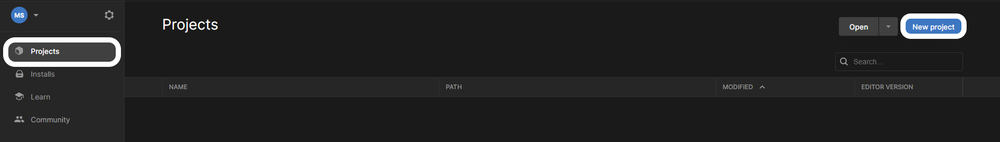

Ouvre Unity Hub, assure-toi que **Projects** est sélectionné dans le menu de gauche, puis clique sur **New project**.

Choisis **All templates** et sélectionne **3D Core** dans le menu suivant, puis donne à ton projet un nom approprié et clique sur le bouton **Create project**.

