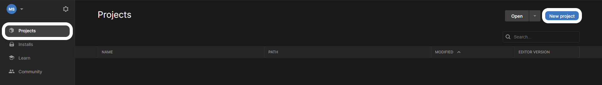
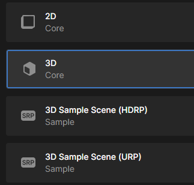

Open the Unity Hub, make sure that **Projects** is selected from the menu on the left, and then click on **New project**.

Choose **All templates** and select **3D Core** from the next menu, then give your project a sensible name and click the **Create project** button.

