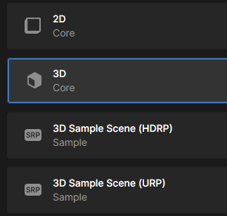

Open de Unity Hub, zorg ervoor dat **Projects** is geselecteerd in het menu aan de linkerkant en klik vervolgens op **New project**.

Kies **All templates** en selecteer **3D Core** uit het volgende menu, geef vervolgens je project een verstandige naam en klik op de knop **Create project**.

